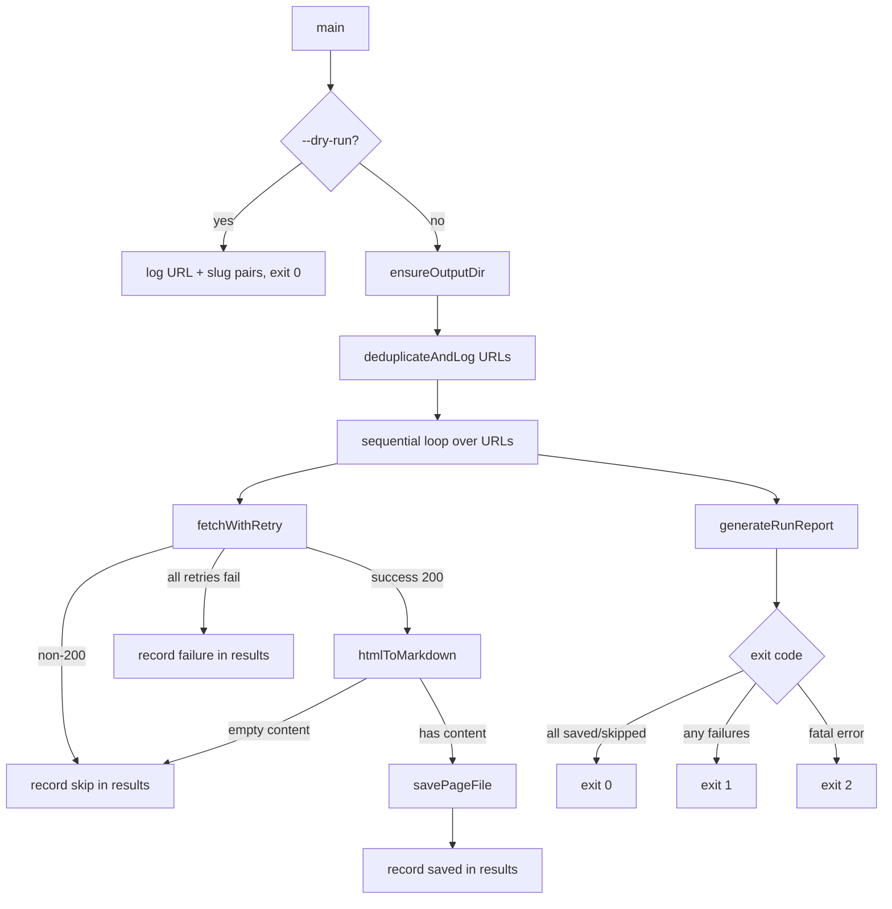
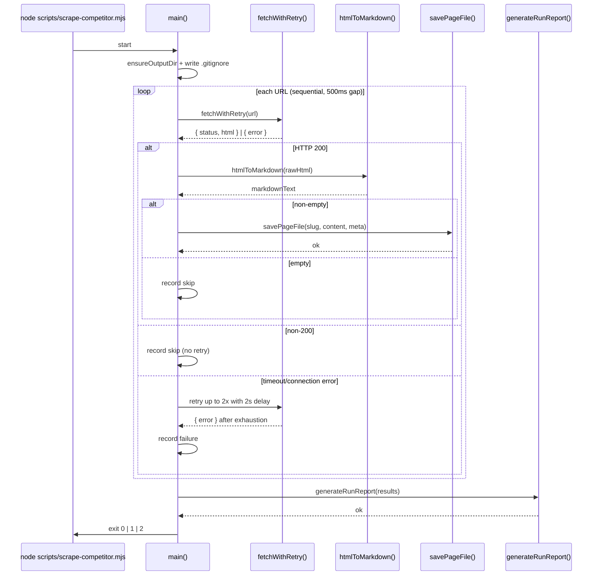
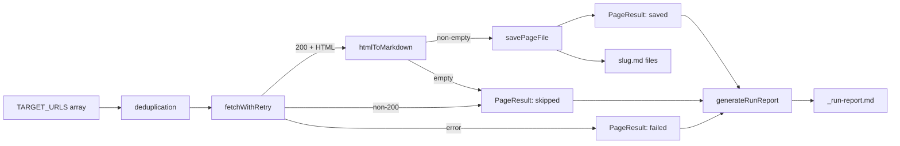

# Design Document: Competitor Content Scraper

## Overview

A single Node.js ESM script (`scripts/scrape-competitor.mjs`) that sequentially fetches 48 hardcoded pages from carolinademoandremoval.com, converts the HTML to clean Markdown, and saves each page as a `.md` file with YAML front-matter to `competitor-content/carolinademoandremoval/`. After all URLs are processed a `_run-report.md` summary is written to the same directory. The script uses only Node.js 22+ built-ins — no additional npm packages.

---

## Architecture

The script is a single ESM module with a flat set of named functions and one top-level `main()` call. There are no classes, no external dependencies, and no dynamic imports.





---

## Components and Interfaces

## Module Structure

```
scripts/scrape-competitor.mjs
│
├── // ── Constants ──────────────────────────────────────────
├── TARGET_URLS          (string[48])
├── OUTPUT_DIR           (string)
├── USER_AGENT           (string)
│
├── // ── Pure helpers ────────────────────────────────────────
├── deriveSlug(url)      → string
├── htmlToMarkdown(html) → string
│
├── // ── I/O helpers ─────────────────────────────────────────
├── fetchWithRetry(url)  → Promise<FetchResult>
├── savePageFile(slug, content, meta) → Promise<void>
├── generateRunReport(results)        → Promise<void>
│
├── // ── Orchestration ───────────────────────────────────────
└── main()               → Promise<void>  (called at bottom)
```

---

## Constants

### TARGET_URLS

```javascript
const TARGET_URLS = [
  // Home
  'https://www.carolinademoandremoval.com/',

  // Core service pages
  'https://www.carolinademoandremoval.com/demolition-services/',
  'https://www.carolinademoandremoval.com/residential-demolition/',
  'https://www.carolinademoandremoval.com/commercial-demolition/',
  'https://www.carolinademoandremoval.com/industrial-demolition/',
  'https://www.carolinademoandremoval.com/interior-demolition/',
  'https://www.carolinademoandremoval.com/selective-demolition/',
  'https://www.carolinademoandremoval.com/structural-demolition/',
  'https://www.carolinademoandremoval.com/building-demolition/',
  'https://www.carolinademoandremoval.com/house-demolition/',

  // Specialty removal
  'https://www.carolinademoandremoval.com/pool-removal/',
  'https://www.carolinademoandremoval.com/deck-removal/',
  'https://www.carolinademoandremoval.com/shed-removal/',
  'https://www.carolinademoandremoval.com/garage-demolition/',
  'https://www.carolinademoandremoval.com/barn-demolition/',
  'https://www.carolinademoandremoval.com/mobile-home-demolition/',
  'https://www.carolinademoandremoval.com/chimney-removal/',
  'https://www.carolinademoandremoval.com/concrete-removal/',
  'https://www.carolinademoandremoval.com/driveway-removal/',
  'https://www.carolinademoandremoval.com/foundation-removal/',

  // Site / land services
  'https://www.carolinademoandremoval.com/site-clearing/',
  'https://www.carolinademoandremoval.com/land-clearing/',
  'https://www.carolinademoandremoval.com/excavation/',
  'https://www.carolinademoandremoval.com/grading/',
  'https://www.carolinademoandremoval.com/debris-removal/',
  'https://www.carolinademoandremoval.com/junk-removal/',
  'https://www.carolinademoandremoval.com/hauling/',

  // Hazardous / specialty
  'https://www.carolinademoandremoval.com/asbestos-abatement/',
  'https://www.carolinademoandremoval.com/lead-paint-removal/',
  'https://www.carolinademoandremoval.com/mold-remediation/',

  // Location pages — North Carolina
  'https://www.carolinademoandremoval.com/north-carolina/',
  'https://www.carolinademoandremoval.com/charlotte-nc/',
  'https://www.carolinademoandremoval.com/raleigh-nc/',
  'https://www.carolinademoandremoval.com/greensboro-nc/',
  'https://www.carolinademoandremoval.com/durham-nc/',
  'https://www.carolinademoandremoval.com/winston-salem-nc/',
  'https://www.carolinademoandremoval.com/fayetteville-nc/',
  'https://www.carolinademoandremoval.com/cary-nc/',
  'https://www.carolinademoandremoval.com/wilmington-nc/',
  'https://www.carolinademoandremoval.com/high-point-nc/',

  // Location pages — South Carolina
  'https://www.carolinademoandremoval.com/south-carolina/',
  'https://www.carolinademoandremoval.com/columbia-sc/',
  'https://www.carolinademoandremoval.com/charleston-sc/',
  'https://www.carolinademoandremoval.com/greenville-sc/',
  'https://www.carolinademoandremoval.com/rock-hill-sc/',

  // Company / info pages
  'https://www.carolinademoandremoval.com/about/',
  'https://www.carolinademoandremoval.com/contact/',
  'https://www.carolinademoandremoval.com/faq/',
];
```

> **Note:** The exact 48 URLs above are placeholders derived from the site's known structure. Before the implementation task, the developer should verify the live sitemap and replace any 404 paths. The array must contain exactly 48 entries; the deduplication check at startup will catch accidental duplicates.

### Other constants

```javascript
const OUTPUT_DIR  = 'competitor-content/carolinademoandremoval';
const TOOL_NAME   = 'competitor-content-scraper';
const VERSION     = '1.0.0';
const USER_AGENT  = `${TOOL_NAME}/${VERSION}`;  // ≤ 200 chars
```

---

## Data Models

The script uses plain JavaScript objects (no classes). The key shapes are:

```javascript
// Result of a single fetch attempt
type FetchResult =
  | { ok: true;  status: number; html: string }
  | { ok: false; status: number | null; error: string }

// Per-URL outcome recorded during the run
type PageResult = {
  url:        string;           // original target URL
  slug:       string;           // derived filesystem slug
  status:     'saved' | 'skipped' | 'failed';
  httpStatus: number | null;    // null when no HTTP response received
  reason:     string;           // human-readable outcome description
  filename:   string;           // e.g. "pool-removal.md" or "skipped"
}

// Metadata written into YAML front-matter
type PageMeta = {
  url:        string;
  scrapedAt:  string;           // ISO 8601 timestamp
  httpStatus: number | 'error';
}
```

## Function Specifications

### `deriveSlug(url)`

Converts a URL string into a filesystem-safe slug used as the filename stem.

**Signature:**
```javascript
function deriveSlug(url: string): string
```

**Algorithm:**
```pascal
FUNCTION deriveSlug(url)
  INPUT:  url — a fully-qualified URL string
  OUTPUT: slug — a lowercase, filesystem-safe string

  parsed  ← new URL(url)
  path    ← parsed.pathname          // e.g. "/pool-removal/"

  IF path = "/" OR path = "" THEN
    RETURN "home"
  END IF

  path ← path.replace(/^\/|\/$/g, "")   // strip leading/trailing slashes
  path ← path.replace(/\//g, "--")       // inner slashes → double-hyphen
  path ← path.replace(/[^a-z0-9-]/gi, "-")  // non-alphanumeric → hyphen
  path ← path.replace(/-{2,}/g, "-")    // collapse runs of hyphens
  path ← path.toLowerCase()

  RETURN path
END FUNCTION
```

**Preconditions:**
- `url` is a valid absolute URL string parseable by `new URL()`

**Postconditions:**
- Returns `"home"` for the root path
- Result contains only `[a-z0-9-]` characters
- No leading, trailing, or consecutive hyphens in the result

**Examples:**

| URL | Slug |
|-----|------|
| `https://www.carolinademoandremoval.com/` | `home` |
| `https://www.carolinademoandremoval.com/pool-removal/` | `pool-removal` |
| `https://www.carolinademoandremoval.com/north-carolina/pool-removal/` | `north-carolina--pool-removal` |
| `https://www.carolinademoandremoval.com/charlotte-nc/` | `charlotte-nc` |

---

### `htmlToMarkdown(html)`

Strips navigation chrome and converts structural HTML to Markdown using regex and string manipulation only — no external parser.

**Signature:**
```javascript
function htmlToMarkdown(html: string): string
```

**Algorithm:**
```pascal
FUNCTION htmlToMarkdown(html)
  INPUT:  html — raw HTML string
  OUTPUT: markdown — clean Markdown string (may be empty)

  // Step 1: Remove entire elements that contain non-content
  FOR each tag IN [script, style, nav, header, footer, noscript, iframe, svg] DO
    html ← html.replace(/<tag[\s\S]*?<\/tag>/gi, "")
  END FOR

  // Step 2: Convert headings (h1–h6)
  FOR level FROM 1 TO 6 DO
    prefix ← "#".repeat(level) + " "
    html ← html.replace(/<h{level}[^>]*>([\s\S]*?)<\/h{level}>/gi,
              (_, inner) => "\n\n" + prefix + stripTags(inner).trim() + "\n\n")
  END FOR

  // Step 3: Convert links — <a href="...">text</a> → [text](href)
  html ← html.replace(/<a\s[^>]*href="([^"]*)"[^>]*>([\s\S]*?)<\/a>/gi,
            (_, href, inner) => "[" + stripTags(inner).trim() + "](" + href + ")")

  // Step 4: Convert images — keep alt text only
  html ← html.replace(/]*alt="([^"]+)"[^>]*\/?>/gi, (_, alt) => alt)
  html ← html.replace(/]*\/?>/gi, "")   // no alt → remove

  // Step 5: Convert list items
  html ← html.replace(/<li[^>]*>([\s\S]*?)<\/li>/gi,
            (_, inner) => "- " + stripTags(inner).trim())

  // Step 6: Convert paragraphs
  html ← html.replace(/<p[^>]*>([\s\S]*?)<\/p>/gi,
            (_, inner) => "\n\n" + stripTags(inner).trim() + "\n\n")

  // Step 7: Convert <br> to newline
  html ← html.replace(/<br\s*\/?>/gi, "\n")

  // Step 8: Strip all remaining tags
  html ← html.replace(/<[^>]+>/g, "")

  // Step 9: Decode common HTML entities
  html ← html.replace(/&amp;/g, "&")
             .replace(/&lt;/g, "<")
             .replace(/&gt;/g, ">")
             .replace(/&quot;/g, '"')
             .replace(/&#39;/g, "'")
             .replace(/&nbsp;/g, " ")

  // Step 10: Normalise whitespace
  html ← html.replace(/\r\n/g, "\n")
  html ← html.replace(/[ \t]+/g, " ")          // collapse inline whitespace
  html ← html.replace(/\n{3,}/g, "\n\n")       // max two consecutive newlines
  html ← html.trim()

  RETURN html
END FUNCTION

// Internal helper — strips tags from a captured inner HTML fragment
FUNCTION stripTags(fragment)
  RETURN fragment.replace(/<[^>]+>/g, "").trim()
END FUNCTION
```

**Preconditions:**
- `html` is a string (may be empty)

**Postconditions:**
- No `<script>`, `<style>`, `<nav>`, `<header>`, `<footer>`, or `<noscript>` content remains
- `<h1>`–`<h6>` are rendered as `#`–`######` Markdown headings
- `<a>` tags become `[text](href)` Markdown links
- `` tags are replaced by alt text or removed
- `<li>` items begin with `- `
- No raw HTML tags remain in the output
- No sequence of more than two consecutive blank lines
- Result is trimmed

---

### `fetchWithRetry(url)`

Fetches a URL using the Node.js 22 built-in `fetch` with a 10-second timeout and up to 2 retries on connection/timeout failures only.

**Signature:**
```javascript
async function fetchWithRetry(url: string): Promise<FetchResult>

// Return type
type FetchResult =
  | { ok: true;  status: number; html: string }
  | { ok: false; status: number | null; error: string }
```

**Algorithm:**
```pascal
FUNCTION fetchWithRetry(url)
  INPUT:  url — target URL string
  OUTPUT: FetchResult

  maxAttempts ← 3
  retryDelay  ← 2000  // ms

  FOR attempt FROM 1 TO maxAttempts DO
    controller ← new AbortController()
    timer      ← setTimeout(() => controller.abort(), 10000)

    TRY
      response ← await fetch(url, {
        method:  "GET",
        headers: { "User-Agent": USER_AGENT },
        signal:  controller.signal
      })
      clearTimeout(timer)

      IF response.status ≠ 200 THEN
        // Non-200: record and return immediately — no retry
        RETURN { ok: false, status: response.status, error: "HTTP " + response.status }
      END IF

      html ← await response.text()
      RETURN { ok: true, status: 200, html: html }

    CATCH error
      clearTimeout(timer)

      IF attempt < maxAttempts THEN
        await sleep(retryDelay)
        CONTINUE  // next attempt
      ELSE
        RETURN { ok: false, status: null, error: error.message }
      END IF
    END TRY
  END FOR
END FUNCTION
```

**Preconditions:**
- `url` is a valid absolute URL string
- Node.js 22+ global `fetch` is available

**Postconditions:**
- Non-200 HTTP responses return immediately without retry
- Connection errors and AbortController timeouts trigger up to 2 retries
- Always returns a `FetchResult` — never throws

**Loop invariant:** On each iteration `attempt` increases by 1; the loop terminates after at most 3 iterations.

---

### `savePageFile(slug, content, meta)`

Writes a single Markdown file with YAML front-matter to the output directory.

**Signature:**
```javascript
async function savePageFile(
  slug:    string,
  content: string,
  meta:    { url: string; scrapedAt: string; httpStatus: number | 'error' }
): Promise<void>
```

**File format:**
```
---
url: https://www.carolinademoandremoval.com/pool-removal/
scraped_at: 2025-01-15T14:32:00.000Z
http_status: 200
---

# Pool Removal

[Extracted Markdown content...]
```

**Algorithm:**
```pascal
FUNCTION savePageFile(slug, content, meta)
  frontMatter ← "---\n"
              + "url: " + meta.url + "\n"
              + "scraped_at: " + meta.scrapedAt + "\n"
              + "http_status: " + meta.httpStatus + "\n"
              + "---\n\n"

  fileContent ← frontMatter + content
  filePath    ← path.join(OUTPUT_DIR, slug + ".md")

  await fs.writeFile(filePath, fileContent, "utf8")
END FUNCTION
```

**Preconditions:**
- `OUTPUT_DIR` exists (created by `main()` before this is called)
- `slug` contains only `[a-z0-9-]` characters
- `content` is non-empty (caller checks before calling)

**Postconditions:**
- File at `{OUTPUT_DIR}/{slug}.md` exists with UTF-8 encoding
- File begins with a valid YAML front-matter block
- Any pre-existing file at that path is overwritten

---

### `generateRunReport(results)`

Writes `_run-report.md` to the output directory summarising the entire run.

**Signature:**
```javascript
async function generateRunReport(results: PageResult[]): Promise<void>

type PageResult = {
  url:      string;
  slug:     string;
  status:   'saved' | 'skipped' | 'failed';
  httpStatus: number | null;
  reason:   string;   // e.g. "HTTP 404", "timeout", "empty content", "saved"
  filename: string;   // e.g. "pool-removal.md" or "skipped"
}
```

**Report format:**
```markdown
Run completed: 2025-01-15T14:35:42.000Z
Attempted: 48 | Saved: 45 | Failed: 1 | Skipped: 2

| URL | Status | Filename |
|-----|--------|----------|
| https://www.carolinademoandremoval.com/ | 200 | home.md |
| https://www.carolinademoandremoval.com/pool-removal/ | 200 | pool-removal.md |
| https://www.carolinademoandremoval.com/missing-page/ | 404 | skipped |
```

**Algorithm:**
```pascal
FUNCTION generateRunReport(results)
  saved   ← results.filter(r => r.status = "saved").length
  failed  ← results.filter(r => r.status = "failed").length
  skipped ← results.filter(r => r.status = "skipped").length

  header ← "Run completed: " + new Date().toISOString() + "\n"
          + "Attempted: " + results.length
          + " | Saved: " + saved
          + " | Failed: " + failed
          + " | Skipped: " + skipped + "\n\n"

  tableHeader ← "| URL | Status | Filename |\n"
              + "|-----|--------|----------|\n"

  rows ← results.map(r =>
    "| " + r.url + " | " + (r.httpStatus ?? r.reason) + " | " + r.filename + " |"
  ).join("\n")

  reportContent ← header + tableHeader + rows + "\n"
  reportPath    ← path.join(OUTPUT_DIR, "_run-report.md")

  TRY
    await fs.writeFile(reportPath, reportContent, "utf8")
  CATCH error
    console.error("Fatal: could not write run report:", error.message)
    process.exit(2)
  END TRY
END FUNCTION
```

**Preconditions:**
- `results` contains one entry per processed URL
- `OUTPUT_DIR` exists

**Postconditions:**
- `_run-report.md` exists in `OUTPUT_DIR` with correct summary counts
- Any previous report is overwritten
- On write failure: logs to stderr and exits with code 2

---

### `main()`

Top-level orchestration function. Handles `--dry-run`, directory setup, the sequential fetch loop, and exit codes.

**Signature:**
```javascript
async function main(): Promise<void>
```

**Algorithm:**
```pascal
FUNCTION main()
  dryRun ← process.argv.includes("--dry-run")

  // ── Dry-run mode ──────────────────────────────────────────
  IF dryRun THEN
    FOR each url IN TARGET_URLS DO
      slug ← deriveSlug(url)
      console.log(url + "  →  " + slug + ".md")
    END FOR
    process.exit(0)
  END IF

  // ── Startup checks ────────────────────────────────────────
  TRY
    await fs.mkdir(OUTPUT_DIR, { recursive: true })
    await fs.writeFile(path.join(OUTPUT_DIR, ".gitignore"), "*\n", "utf8")
  CATCH error
    console.error("Fatal: cannot create output directory:", error.message)
    process.exit(2)
  END TRY

  // ── Deduplication ─────────────────────────────────────────
  seen    ← new Set()
  unique  ← []
  FOR each url IN TARGET_URLS DO
    IF seen.has(url) THEN
      console.warn("Warning: duplicate URL skipped:", url)
    ELSE
      seen.add(url)
      unique.push(url)
    END IF
  END FOR

  IF unique.length < 48 THEN
    console.warn("Warning: only " + unique.length + " unique URLs (expected 48)")
  END IF

  console.log("Starting scrape of " + unique.length + " URLs...")

  // ── Sequential fetch loop ─────────────────────────────────
  results ← []

  FOR i FROM 0 TO unique.length - 1 DO
    url  ← unique[i]
    slug ← deriveSlug(url)

    IF i > 0 THEN
      await sleep(500)   // 500ms inter-request delay
    END IF

    result ← await fetchWithRetry(url)

    IF result.ok THEN
      markdown ← htmlToMarkdown(result.html)

      IF markdown.length = 0 THEN
        console.log("[SKIP] " + url + " — empty content after extraction")
        results.push({ url, slug, status: "skipped", httpStatus: 200,
                       reason: "empty content", filename: "skipped" })
      ELSE
        TRY
          await savePageFile(slug, markdown, {
            url,
            scrapedAt:  new Date().toISOString(),
            httpStatus: 200
          })
          console.log("[SAVED] " + url + " → " + slug + ".md")
          results.push({ url, slug, status: "saved", httpStatus: 200,
                         reason: "saved", filename: slug + ".md" })
        CATCH writeError
          console.error("[ERROR] write failed for " + url + ":", writeError.message)
          results.push({ url, slug, status: "failed", httpStatus: 200,
                         reason: writeError.message, filename: "skipped" })
        END TRY
      END IF

    ELSE IF result.status ≠ null THEN
      // Non-200 HTTP response — skip, no retry
      console.log("[SKIP] " + url + " — HTTP " + result.status)
      results.push({ url, slug, status: "skipped", httpStatus: result.status,
                     reason: "HTTP " + result.status, filename: "skipped" })

    ELSE
      // Network/timeout failure after all retries
      console.error("[FAIL] " + url + " — " + result.error)
      results.push({ url, slug, status: "failed", httpStatus: null,
                     reason: result.error, filename: "skipped" })
    END IF
  END FOR

  // ── Run report ────────────────────────────────────────────
  await generateRunReport(results)

  // ── Exit code ─────────────────────────────────────────────
  anyFailed ← results.some(r => r.status = "failed")
  process.exit(anyFailed ? 1 : 0)
END FUNCTION

// ── Entry point ───────────────────────────────────────────────
main()
```

**Exit codes:**

| Code | Condition |
|------|-----------|
| `0` | All URLs saved or skipped (non-200 / empty content) |
| `1` | One or more URLs failed (network error / timeout after all retries) |
| `2` | Fatal error (output directory creation failed, run report write failed) |

---

## Data Flow



---

## Error Handling

| Scenario | Behaviour | Exit code impact |
|----------|-----------|-----------------|
| Duplicate URL in `TARGET_URLS` | Warn + skip duplicate | None |
| `OUTPUT_DIR` creation fails | Log to stderr, exit immediately | `2` |
| HTTP non-200 response | Record as skipped, no retry | `0` (skipped ≠ failed) |
| Connection error / timeout | Retry up to 2×, then record as failed | `1` |
| Empty content after extraction | Record as skipped | `0` |
| File write error | Record as failed, continue | `1` |
| Run report write error | Log to stderr, exit immediately | `2` |

---

## Correctness Properties

These properties must hold for any valid execution of the script.

### Property 1: URL completeness

For every URL in `TARGET_URLS` (after deduplication), exactly one entry exists in `results` — no URL is silently dropped or processed more than once.

**Validates: Requirements 1.1, 1.3**

### Property 2: Slug safety

For all URLs `u`, `deriveSlug(u)` matches `/^[a-z0-9][a-z0-9-]*$|^home$/` — the result contains only `[a-z0-9-]`, has no leading or trailing hyphens, and has no consecutive hyphens.

**Validates: Requirements 4.2, 4.3**

### Property 3: Slug uniqueness

`deriveSlug` produces a distinct slug for every distinct URL path in `TARGET_URLS` — no two different URLs map to the same output filename.

**Validates: Requirements 4.2, 4.3**

### Property 4: No HTML tag leakage

For all HTML strings `h`, `htmlToMarkdown(h)` contains no substrings matching `/<[a-zA-Z]` — all HTML tags are removed or converted.

**Validates: Requirements 3.1, 3.5**

### Property 5: Idempotent extraction

`htmlToMarkdown(htmlToMarkdown(h)) === htmlToMarkdown(h)` for all strings `h` — applying the conversion twice yields the same result as applying it once.

**Validates: Requirements 3.5, 3.6**

### Property 6: Front-matter validity

Every saved `.md` file begins with `---\n` and contains the fields `url:`, `scraped_at:`, and `http_status:` before the closing `---` fence.

**Validates: Requirements 4.5, 4.6**

### Property 7: Report completeness

The row count in `_run-report.md` equals the number of unique URLs processed, and the summary counts (Saved + Failed + Skipped) sum to the total attempted count.

**Validates: Requirements 5.2, 5.3**

### Property 8: Exit code contract

Exit code is `0` if and only if no entry in `results` has `status === 'failed'`; exit code is `1` if one or more entries have `status === 'failed'`; exit code is `2` only on fatal I/O errors that prevent normal completion.

**Validates: Requirements 6.5, 6.6, 6.7**

### Property 9: Non-200 responses are never retried

A non-200 HTTP response causes `fetchWithRetry` to return immediately with `ok: false` — the retry loop is only entered on connection errors and timeouts.

**Validates: Requirements 2.3, 2.7**

### Property 10: Retry bound

For any single URL, the underlying `fetch` call is made at most 3 times total (1 initial attempt + up to 2 retries).

**Validates: Requirements 2.4, 2.5**

## Testing Strategy

### Unit Testing Approach

Each pure function is independently testable with Vitest (already in `devDependencies`).

**`deriveSlug`** — table-driven tests covering:
- Root URL → `"home"`
- Single-segment path → no double-hyphens
- Multi-segment path → inner `/` becomes `--`
- Special characters → replaced with `-`, no consecutive hyphens

**`htmlToMarkdown`** — tests covering:
- `<script>` / `<style>` / `<nav>` blocks are fully removed
- `<h1>`–`<h6>` → correct `#` prefix count
- `<a href>` → `[text](href)` format
- `` → alt text; `` without alt → empty
- `<li>` → `- ` prefix
- `<p>` → blank-line-separated paragraphs
- HTML entity decoding (`&amp;`, `&nbsp;`, etc.)
- Consecutive blank lines collapsed to two
- Empty input → empty output

### Property-Based Testing Approach

**Property-based test library**: `fast-check` (not currently in `package.json` — add as a `devDependency` if property tests are written, or use Vitest's built-in `fc` integration).

Key properties:
- `deriveSlug(url)` result always matches `/^[a-z0-9][a-z0-9-]*[a-z0-9]$|^home$|^[a-z0-9]$/`
- `htmlToMarkdown(html)` result never contains `<` followed by a tag name
- `htmlToMarkdown(htmlToMarkdown(html))` is idempotent (applying twice gives same result)

### Integration Testing Approach

Run the script with `--dry-run` in CI to verify all 48 slugs are logged without network access. A full integration test would require network access and is best run manually.

---

## Security Considerations

- The script only makes outbound GET requests to a single known domain; no user-supplied URLs are accepted.
- The `User-Agent` header is a fixed string under 200 characters; no user input is interpolated into headers.
- File paths are derived from URL paths via `deriveSlug`, which strips all characters outside `[a-z0-9-]`, preventing path traversal.
- No credentials or secrets are used.

---

## Performance Considerations

- Sequential processing with a 500ms inter-request delay keeps the scraper polite and avoids rate-limiting.
- The 10-second `AbortController` timeout prevents indefinite hangs on slow responses.
- 48 URLs × ~500ms minimum gap = ~24 seconds minimum run time; with typical fetch latency expect 1–3 minutes total.
- No parallelism is used intentionally to respect the target server.

---

## Dependencies

All dependencies are Node.js 22+ built-ins:

| Module | Usage |
|--------|-------|
| `node:fs/promises` | `mkdir`, `writeFile` |
| `node:path` | `path.join` |
| `node:url` | `new URL()` in `deriveSlug` |
| `node:process` | `process.argv`, `process.exit` |
| Global `fetch` | HTTP requests (Node.js 22 built-in) |
| Global `AbortController` | Request timeout |

No additional npm packages are required. The script is compatible with the existing `package.json` (`"type": "module"`, `"engines": { "node": ">=22.12.0" }`).

---

## Setup Note (gitignore)

To prevent scraped content from being committed, add the following line to the project's `.gitignore`:

```
competitor-content/
```

The script also writes a `*` `.gitignore` inside the output directory itself on every run, so files are never seen as untracked even before the project-level entry is added.
